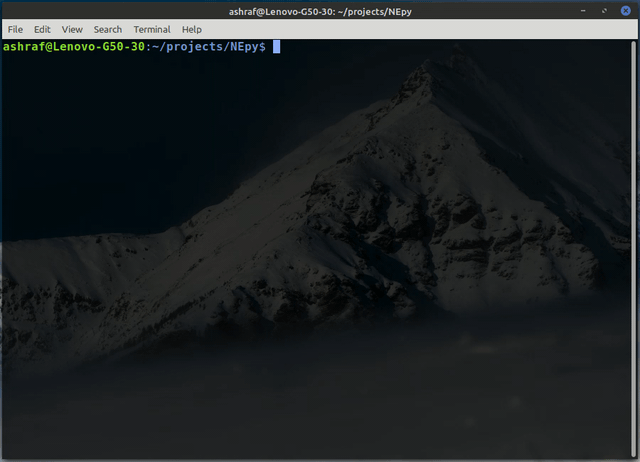

# A Remote Network Scanner written in Python

This command-line Python program is an extention of my LAN Scanner program that scans a LAN, this scans a non-local network and returns a list of active IPs in that network. Instead of `srp()` method [which works on Layer 2 and is used in LAN Scanner], this program uses `sr()` method which works on Layer 3. While the logic of scanning the network remains the same as in LAN Scanner, the implementation differs by using `ICMP()` and `IP()` methods instead of `Ether()` and `ARP()` methods.
***
## PRE-REQUISITES

1. This program requires sudo privilages
2. It should have python 3.x insatlled (Python can be installed from its official site - www.python.org).
3. It should have scapy 2.x installed. Scapy's installation can be carried out / verified with the command: `pip3 install scapy`.

***

## FEATURES
This program has following features:
1. Take user input for the subnet to scan
2. Verify the input for any typo using regex
3. Scan the remote subnet rigorously making sure not to miss any host
4. Display a status bar while scanning is in progress
5. Sort the list of hosts scanned based on their IP addresses
6. Display the result is a legible format displaying IPs for each alive host

***
## A Demo showing the scan

You can view the code [here](wan_scanner.py) and can leave a :star: if you like it. :smile:
